# bkahlert/recordr [](https://github.com/bkahlert/recordr/actions/workflows/build-and-publish.yml) [](https://github.com/bkahlert/recordr) [](https://github.com/bkahlert/recordr/blob/master/LICENSE)

## About
**Recordr** is an automated terminal session recorder and to SVG converter. 

[  
Recordr Demo](../../raw/master/docs/demo.svg)

[  
Recordr recording the Recordr Demo](../../raw/master/docs/recordr.svg)

[  
Recordr recording the logr Demo](../../raw/master/docs/logr.svg)

[  
Recordr recording chafa converting Nyan Cat](../../raw/master/docs/chafa.svg)

## Bash script

`recordr` is a Bash script. 

In order to use it, it can either be downloaded and run like a binary or used as a [Docker image](#docker-image).

To download recordr you can type:
```shell
sudo curl -LfsSo /usr/local/bin/recordr https://raw.githubusercontent.com/bkahlert/recordr/master/recordr
chmod +x /usr/local/bin/recordr
```

## Docker image

### Build locally

```shell
git clone https://github.com/bkahlert/recordr.git
cd recordr

# Build image and output to docker (default)
docker buildx bake

# Build multi-platform image
docker buildx bake image-all
```

### Image

* [Docker Hub](https://hub.docker.com/r/bkahlert/recordr/) `bkahlert/recordr`
* [GitHub Container Registry](https://github.com/users/bkahlert/packages/container/package/recordr) `ghcr.io/bkahlert/recordr`

Following platforms for this image are available:

* linux/amd64
* linux/arm64/v8

## Usage

By default, `recordr` checks the current working directory for `.rec` files,
converts all of them concurrently to SVG animations and puts them in a `docs` directory.

The following options can be used to customize the conversion:
 - `--rows` — number of rows to use for recording and conversion (default: 25)
 - `--indicator` — name of the environmental variable set during recording (default: RECORDING)
 - `--term` — value to use for the TERM environmental variable (default: xterm-256color)
 - `--out-dir` — path to copy the created SVG files to (default: docs/)
 - `--rec-dir` — path to prefix specified rec files with (default: rec/)
 - `--columns` — number of columns to use for recording and conversion (default: 132)
 - `--parallel` — maximum number of conversions that run at once; 0 will run as many conversions as possible (default: 4)
 - `--restart-delay` — number of seconds until the animation restart (default: 5)
 - `--build-dir` — path to store (intermediate) build artifacts in (default: build/rec/)
 - `--term-profile` — path to the terminal profile to use for conversion (default: auto)
 - `--hide-recording` — flag that if specified will not show the recording process (default during batch mode)
 - `--delete-build` — flag that if specified will keep delete intermediary build files on completion

Files only need to be passed if you don't want the whole rec directory to be converted.

### Bash script

```shell
recordr [OPTIONS] [FILE...] 
```

### Docker image

```shell
docker run -it --rm \ 
  -e TERM=$TERM \
  -v "$PWD:$PWD" \
  -w "$PWD" \
  bkahlert/recordr [OPTIONS] [FILE...]
```

## Image Configuration

This image can be configured using the following options of which all but `APP_USER` and `APP_GROUP` exist as both—build argument and environment variable.  
You should go for build arguments if you want to set custom defaults you don't intend to change (often). Environment variables will overrule any existing
configuration on each container start.

* `APP_USER` Name of the main user (default: recordr).
* `APP_GROUP` Name of the main user's group (default: recordr).

* `TZ` Timezone the container runs in (default: `UTC`)
* `LANG` Language/locale to use (default: `C.UTF-8`)
* `PUID` User ID of the `libguestfs` user (default: `1000`)
* `PGID` Group ID of the `libguestfs` group (default: `1000`)

```shell
# Build single image with build argument TZ
docker buildx bake --build-arg TZ="$(date +"%Z")"

# Build multi-platform image with build argument TZ
docker buildx bake image-all --build-arg TZ="$(date +"%Z")"

# Start container with environment variable TZ
docker run --rm \
  -e TZ="$(date +"%Z")" \
  -v "$(pwd):$(pwd)" \
  -w "$(pwd)" \
  bkahlert/recordr:edge
```

## Testing

```shell
git clone https://github.com/bkahlert/recordr.git
cd recordr

# Use Bats wrapper to run tests
chmod +x ./batsw
DOCKER_BAKE="--set *.tags=test" \
  ./batsw test
```

[Bats Wrapper](https://github.com/bkahlert/bats-wrapper) is a self-contained wrapper to run tests based on the
Bash testing framework [Bats](https://github.com/bats-core/bats-core).

> 💡 To accelerate testing, the Bats Wrapper checks if any test is prefixed with a capital X and if so, only runs those tests.

## Troubleshooting

- You might experience problems when converting very long or complex terminal sessions.   
  Try increasing the corresponding `NODE_OPTIONS` as you can see below.
- To avoid permission problems with generated files, you can use your local
  user/group ID (see `PUID`/`PGID`).
- If you need access to Docker, its command line interface is already installed.  
  You can control your host instance by mounting `/var/run/docker.sock`.

```shell
docker run -it --rm \
  -e PUID="$(id -u)" \
  -e PGID="$(id -g)" \
  -e NODE_OPTIONS="--max-old-space-size=16384" \
  -e TERM="$TERM" \
  -v /var/run/docker.sock:/var/run/docker.sock \
  -v "$PWD:$PWD" \
  -w "$PWD" \
  bkahlert/recordr:edge
```

## Contributing

Want to contribute? Awesome! The most basic way to show your support is to star the project, or to raise issues. You
can also support this project by making
a [Paypal donation](https://www.paypal.me/bkahlert) to ensure this journey continues indefinitely!

Thanks again for your support, it is much appreciated! :pray:


## License

MIT. See [LICENSE](LICENSE) for more details.


## TODO

- [ ] parametrize version
- [ ] auto-build recording with workflow
- [ ] recordrw - wrapper
