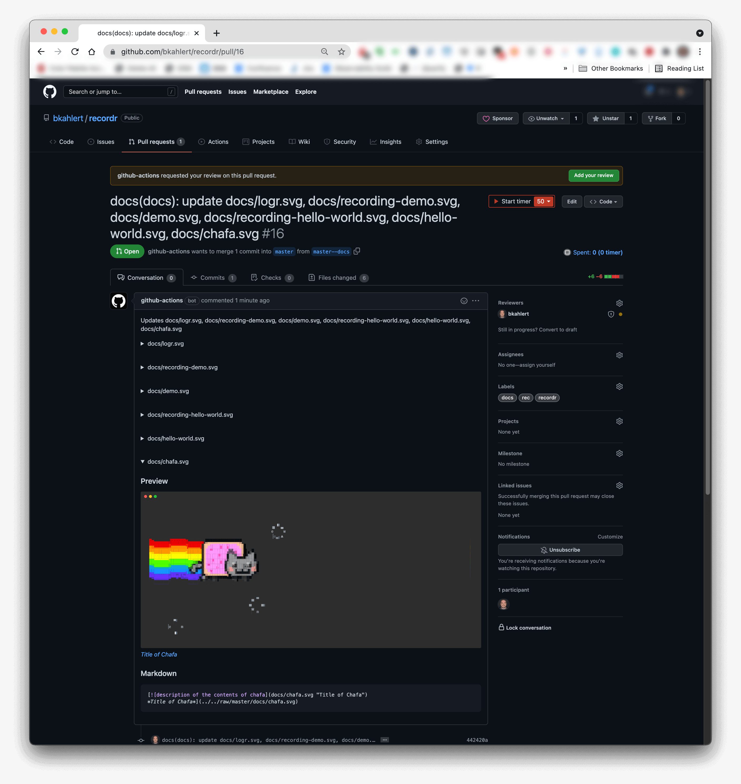

# bkahlert/recordr [](https://github.com/bkahlert/recordr/actions/workflows/build.yml) [](https://github.com/bkahlert/recordr) [](https://github.com/bkahlert/recordr/blob/master/LICENSE)

## About

**Recordr** lets you record terminal sessions and convert them to SVG.

[  
*Recordr Demo*](../../raw/master/docs/demo.svg)

[  
*Recordr recording the Recordr Demo*](../../raw/master/docs/recording-demo.svg)

[  
*Recordr recording the logr Demo*](../../raw/master/docs/logr.svg)

[  
*Recordr recording chafa converting Nyan Cat*](../../raw/master/docs/chafa.svg)

## Bash script

`recordr` is a Bash script.

In order to use it, it can either be downloaded and run like a binary or used as a [Docker image](#docker-image).

To download recordr you can type:

```shell
sudo curl -LfsSo /usr/local/bin/recordr https://raw.githubusercontent.com/bkahlert/recordr/master/recordr
chmod +x /usr/local/bin/recordr
```

## Docker image

### Build locally

```shell
git clone https://github.com/bkahlert/recordr.git
cd recordr

# Build image and output to docker (default)
docker buildx bake

# Build multi-platform image
docker buildx bake image-all
```

### Image

* [Docker Hub](https://hub.docker.com/r/bkahlert/recordr/) `bkahlert/recordr`
* [GitHub Container Registry](https://github.com/users/bkahlert/packages/container/package/recordr) `ghcr.io/bkahlert/recordr`

Following platforms for this image are available:

* linux/amd64
* linux/arm64/v8

## Usage

By default, `recordr` looks for a `rec` directory in the current working directory, converts all contained
<span style="color:#c21e73">● rec</span> files concurrently to SVG animations and puts them in a `docs`
directory.

The following options can be used to customize the conversion:

- `--rows` — number of rows to use for recording and conversion (default: 25)
- `--indicator` — name of the environmental variable set during recording (default: RECORDING)
- `--term` — value to use for the TERM environmental variable (default: xterm-256color)
- `--out-dir` — path to copy the created SVG files to (default: docs/)
- `--columns` — number of columns to use for recording and conversion (default: 132)
- `--parallel` — maximum number of conversions that run at once; 0 will run as many conversions as possible (default: 4)
- `--restart-delay` — number of seconds until the animation restart (default: 5)
- `--build-dir` — path to store (intermediate) build artifacts (default: build/rec/)
- `--term-profile` — path to the terminal profile to use for conversion (default: auto)
- `--hide-recording` — whether to hide the recording process (default: false)
- `--delete-build` — whether to delete intermediary build files on completion (default: false)

**Files:**
There are basically two ways to specify which
<span style="color:#c21e73">● rec</span> files to convert:

- **Convert a single file: `./recordr rec/foo.rec`**  
  *same as: `./rec/foo.rec` (interpreter form)*  
  *same as: `./recordr --build-dir build/rec --out-dir docs rec/foo.rec` (explicit directories)*  
  **Before:**
  ```text
  📁work             ⬅︎ you are here  
  └─📁rec
    ├─🔴foo.rec
    └─📁bar
      └─🔴baz.rec
  ```
  **After:**
  ```text
  📁work             ⬅︎ you are here  
  ├─📁rec
  │ ├─🔴foo.rec
  │ └─📁bar
  │   └─🔴baz.rec
  ├─📁build
  │ └─📁rec
  │   ├─📄foo.sh
  │   ├─📄foo.svg.0
  │   ├─📄foo.svg.⋮
  │   └─📄foo.svg.n
  └─📁docs
    └─🔴foo.svg      ⬅︎ to SVG converted rec file   
  ```

- **Convert a file tree: `./recordr rec`**  
  *same as: `./recordr` (default directory: rec)*  
  *same as: `./recordr --build-dir build/rec --out-dir docs rec` (explicit default directories)*    
  *same as: `./recordr rec foo.rec bar/baz.rec` (explicit files)*    
  **Before:**
  ```text
  📁work             ⬅︎ you are here  
  └─📁rec
    ├─🔴foo.rec
    └─📁bar
      └─🔴baz.rec
  ```
  **After:**
  ```text
  📁work             ⬅︎ you are here  
  ├─📁rec
  │ ├─🔴foo.rec
  │ └─📁bar
  │   └─🔴baz.rec
  ├─📁build
  │ └─📁rec
  │   ├─📄foo.sh
  │   ├─📄foo.svg.0
  │   ├─📄foo.svg.⋮
  │   ├─📄foo.svg.n
  │   └─📁bar
  │     ├─📄baz.sh
  │     ├─📄baz.svg.0
  │     ├─📄baz.svg.⋮
  │     └─📄baz.svg.n
  └─📁docs
    ├─🔴foo.svg      ⬅︎ to SVG converted rec file
    └─📁bar
      └─🔴baz.svg    ⬅︎ to SVG converted rec file
  ```

To customize colors just export your settings from your favourite terminal emulator
(see [supported profiles](https://github.com/marionebl/term-schemes#supported-formats)) and put the profile in the directory containing your
<span style="color:#c21e73">● rec</span> files.  
The profile will be picked up automatically if you leave `--term-profile` to `auto`.

### Bash script

```shell
recordr [OPTIONS] [DIR[/ ]FILE [FILE...]]
```

### Docker image

```shell
docker run -it --rm \
  -e TERM="$TERM" \
  -v "$PWD":"$PWD" \
  -w "$PWD" \
  bkahlert/recordr [OPTIONS] [DIR[/ ]FILE [FILE...]]
```

### Wrapper

The Recordr Wrapper `recordrw` needs nothing but a working Docker installation and either [`curl`](https://curl.se/download.html)
, [`wget`](http://wget.addictivecode.org/FrequentlyAskedQuestions.html#download),
or [`wget2`](https://gitlab.com/gnuwget/wget2#downloading-and-building-from-tarball):

#### curl

```shell
curl -LfsS https://git.io/recordrw | "$SHELL" -s -- [OPTIONS] [DIR[/ ]FILE [FILE...]]
```

#### wget

```shell
wget -qO- https://git.io/recordrw | "$SHELL" -s -- [OPTIONS] [DIR[/ ]FILE [FILE...]]
```

#### wget2

```shell
wget2 -nv -O- https://git.io/recordrw | "$SHELL" -s -- [OPTIONS] [DIR[/ ]FILE [FILE...]]
```

### GitHub Action

Recordr can also be used to automatically convert your terminal sessions to SVG files as part of your workflow.

The example below demonstrates how Recordr can be used to create a pull request containing all updated SVG files and 
their preview to show up right inside the pull request's description.  

#### Usage Example

```yml
jobs:
  docs:
    runs-on: ubuntu-latest

    steps:
      - name: Prepare
        id: prep
        run: |
          echo ::set-output name=recordr-branch::"${{ github.ref_name }}--docs"

      - name: Checkout
        uses: actions/checkout@v2

      - name: ● REC terminal sessions
        if: github.event_name != 'pull_request'
        id: recordr
        uses: bkahlert/recordr@v0.2
        with:
          branch: ${{ steps.prep.outputs.recordr-branch }}

      - name: Create pull request
        uses: peter-evans/create-pull-request@v3
        if: startsWith(github.ref, 'refs/heads/')
        with:
          commit-message: |
            ${{ github.workflow }}(docs): update ${{ steps.recordr.outputs.file-list }}
          title: |
            ${{ github.workflow }}(docs): update ${{ steps.recordr.outputs.file-list }}
          body: |
            Updates ${{ steps.recordr.outputs.file-list }}
            ${{ steps.recordr.outputs.markdown }}
          labels: recordr,docs,rec
          branch: ${{ steps.prep.outputs.recordr-branch }}
```

All [described options](#usage) can be used to customize the conversion. Please consult [action.yml](action.yml) for detailed information. 

[  
*Recordr GutHub Action*](.github/workflows/docs.yml)

## Image Configuration

This image can be configured using the following options of which all but `APP_USER` and `APP_GROUP` exist as both—build argument and environment variable.  
You should go for build arguments if you want to set custom defaults you don't intend to change (often). Environment variables will overrule any existing
configuration on each container start.

- `APP_USER` Name of the main user (default: recordr).
- `APP_GROUP` Name of the main user's group (default: recordr).
- `DEBUG` Whether to log debug information (default: `0`)
- `TZ` Timezone the container runs in (default: `UTC`)
- `LANG` Language/locale to use (default: `C.UTF-8`)
- `PUID` User ID of the `libguestfs` user (default: `1000`)
- `PGID` Group ID of the `libguestfs` group (default: `1000`)

```shell
# Build single image with build argument TZ
docker buildx bake --build-arg TZ="$(date +"%Z")"

# Build multi-platform image with build argument TZ
docker buildx bake image-all --build-arg TZ="$(date +"%Z")"

# Start container with environment variable TZ
docker run --rm \
  -e TZ="$(date +"%Z")" \
  -v "$(pwd):$(pwd)" \
  -w "$(pwd)" \
  recordr:local
```

## Authoring <span style="color:#c21e73">● rec</span> files

Before you can convert <span style="color:#c21e73">● rec</span> files to SVG you need to create them.  
The following code snippet should suffice as a starting point:

```sh
#!/usr/bin/env recordr
rec echo "Hello World!"
```
[*hello-world.rec*](rec/hello-world.rec)

[  
*Hello World! Example*](../../raw/master/docs/hello-world.svg)

To convert your file just execute it with `recordr` on your `PATH`:
```shell
PATH=.:$PATH ./hello-world.rec
# or
./recordr hello-world.rec
```

The environment variable `TESTING` will reduce animations to a minimum.  
Set it to `1` for an even better efficiency.

[  
*Recordr recording the Hello World! Example*](../../raw/master/docs/recording-hello-world.svg)

```sh
#!/usr/bin/env recordr
rec echo "Hello World!"
```

## Testing

```shell
git clone https://github.com/bkahlert/recordr.git
cd recordr

# Use Bats wrapper to run tests
chmod +x ./batsw
DOCKER_BAKE="--set *.tags=test" \
  ./batsw test
```

[Bats Wrapper](https://github.com/bkahlert/bats-wrapper) is a self-contained wrapper to run tests based on the Bash testing
framework [Bats](https://github.com/bats-core/bats-core).

> 💡 To accelerate testing, the Bats Wrapper checks if any test is prefixed with a capital X and if so, only runs those tests.

## Troubleshooting

- You might experience problems when converting very long or complex terminal sessions.   
  Try increasing the corresponding `NODE_OPTIONS` as you can see below.
- To avoid permission problems with generated files, you can use your local user/group ID (see `PUID`/`PGID`).
- If you need access to Docker, its command line interface is already installed.  
  You can control your host instance by mounting `/var/run/docker.sock`.

```shell
docker run -it --rm \
  -e PUID="$(id -u)" \
  -e PGID="$(id -g)" \
  -e NODE_OPTIONS="--max-old-space-size=16384" \
  -e TERM="$TERM" \
  -v /var/run/docker.sock:/var/run/docker.sock \
  -v "$PWD":"$PWD" \
  -w "$PWD" \
  bkahlert/recordr:edge
```

- Authoring rec files benefits from short round-trips

## Contributing

Want to contribute? Awesome! The most basic way to show your support is to star the project, or to raise issues. You can also support this project by making
a [Paypal donation](https://www.paypal.me/bkahlert) to ensure this journey continues indefinitely!

Thanks again for your support, it is much appreciated! :pray:

## License

MIT. See [LICENSE](LICENSE) for more details.

## TODO
- [ ] add support for dim and italic
